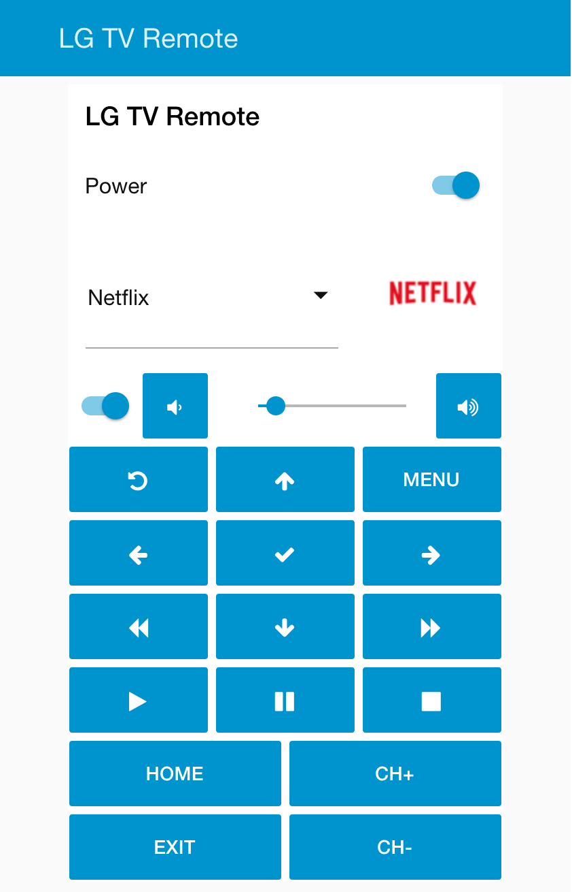

# node-red-contrib-lgtv

[](https://www.npmjs.com/package/node-red-contrib-lgtv)
[](https://www.npmjs.com/package/node-red-contrib-lgtv)
[](https://github.com/hobbyquaker/node-red-contrib-lgtv/actions/workflows/ci.yml)
[![License][mit-badge]][mit-url]

> Node-RED Nodes to control LG webOS Smart TVs :tv:

With these nodes you can:

- Start apps (this also includes changing the HDMI inputs - these are also apps under webOS)
- Change volume / mute
- Turn your TV off, and on again via Wake-on-LAN
- Switch channels on LiveTV
- Press remote buttons
- Move the mouse, drag, scroll and click
- Show popup toasts on your TV, optionally with an icon
- Open a URL in the browser
- Play a video in YouTube
- Send arbitrary commands to the API and receive the response

Some of the nodes have an output, so you can subscribe to events:

- Volume and mute changes
- Foreground app changes
- Channel changes on LiveTV
- Connection state (TV reachable / gone)

**⚠️ node-red-contrib-lgtv >= 2.0 needs Node-RED >= 4.0 and Node.js ^20.19 || ^22.12 || >=24** (primary target:
Node-RED 5 on Node 24). On older versions use node-red-contrib-lgtv 1.x. See [CHANGELOG.md](CHANGELOG.md) for what
changed in 2.0.

The TV communication is done by the [lgtv2](https://github.com/hobbyquaker/lgtv2) module; since 2.0 there is no
native code to compile on install any more, so installation on a Raspberry Pi, in Docker or on Home Assistant OS just
works.

## Setup

1. Make sure the TV is reachable on your network and _LG Connect Apps_ is enabled (Settings → Network on most
   models).
2. Add an `lgtv-config` node with the hostname or IP address of the TV and click **Connect**. The TV shows a pairing
   prompt - accept it, the token is filled in automatically. Newer TVs (firmware from 2023 on) only accept the secure
   websocket on port 3001, older ones only the plain one on port 3000; the default connection setting _auto_ tries both.
3. Optional: enter the TV's MAC address for Wake-on-LAN. Usually not needed - the MAC addresses are learned from the TV
   after the first connection. To turn the TV on over the network the TV setting _Mobile TV On_ / _Turn on via Wi-Fi_
   (2025+ models: _Support → IP control settings → Wake on LAN_) must be enabled.

**Note**: after turning on the TV it takes ~25 seconds until the API is available.

## Nodes

| node      | input                                                                                  | output                                   |
| --------- | -------------------------------------------------------------------------------------- | ---------------------------------------- |
| `control` | `turnOn`, `turnOff`, `turnOnScreen`, `turnOffScreen`, `play`, `pause`, `volumeUp`, ... | connection state `true`/`false`          |
| `app`     | app id, e.g. `netflix`, `com.webos.app.hdmi1`                                          | foreground app id                        |
| `volume`  | 0..100                                                                                 | volume changes                           |
| `mute`    | `true`/`false`                                                                         | mute changes                             |
| `channel` | `channelId` (string) or channel number (number)                                        | current channel while LiveTV is in front |
| `button`  | remote button name, e.g. `HOME`, `ENTER`, `0`..`9`                                     |                                          |
| `mouse`   | `msg.topic` `move`/`drag`/`scroll` with `{dx, dy}`, or `click`                         |                                          |
| `toast`   | message text; optional `msg.url`, `msg.iconData`, `msg.iconExtension`                  |                                          |
| `browser` | URL to open, empty string closes the browser                                           |                                          |
| `youtube` | video id or video URL                                                                  |                                          |
| `request` | `msg.topic` = `ssap://...` uri, `msg.payload` = request payload                        | the response                             |

Every node has a help text in the editor with the details. Failed requests (TV not connected, error answer from the
TV) are reported through `node.error` and can be handled with a **catch** node.

## Usage Example

A flow using node-red-dashboard to create a simple remote control:
http://flows.nodered.org/flow/f497989bef43fb9310837adbff69ce73



## Development

```
npm install
npm test          # lint + tests
npm run test:unit # tests only, against an in-process mock TV
npm run format    # prettier + eslint --fix
```

Releases are made by pushing a `v*` tag: the release workflow runs the tests, publishes to npm (OIDC trusted
publishing, pre-release versions like `2.0.0-dev.1` under the `next` dist-tag) and creates a GitHub release with the
matching CHANGELOG section.

## Support, Contributing

For questions and suggestions open an [Issue](https://github.com/hobbyquaker/node-red-contrib-lgtv/issues/new).
Pull requests welcome!

## License

MIT (c) Sebastian Raff and node-red-contrib-lgtv contributors

[mit-badge]: https://img.shields.io/badge/License-MIT-blue.svg?style=flat
[mit-url]: LICENSE
